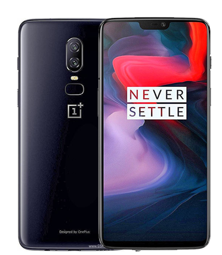
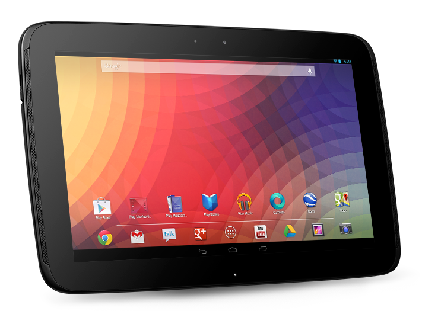

 

<p align="center">
        
</p>


## Device OnePlus 6 ("enchilada")

```
source build/envsetup.sh
breakfast enchilada
```

Now ensure your 6 is connected to your computer via the USB cable, with ADB and root enabled, and that you are in the ~/android/lineage/device/oneplus/enchilada folder. Then run the extract-files.sh script:
```
./extract-files.sh
```

Start the build
Time to start building! Now, type:
```
croot
brunch enchilada
```

## Device Google Nexus 10 ("manta")


```
source build/envsetup.sh
breakfast manta
```

Now ensure your 6 is connected to your computer via the USB cable, with ADB and root enabled, and that you are in the ~/android/lineage/device/oneplus/enchilada folder. Then run the extract-files.sh script:
```
./extract-files.sh
```

Start the build
Time to start building! Now, type:
```
croot
brunch manta
```

## Ubuntu 16.04 LTS 64 bit
- 100Gb free disk

## Download the source code
```sh
chmmod a+x build.sh
```

